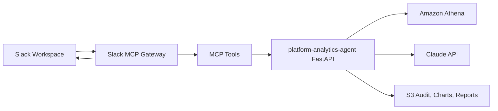

# platform-slack-mcp-gateway

Slack + MCP gateway for the Enterprise Data Platform analytics agent.

This repository is an additive extension. It does not replace or rewrite the
existing `platform-analytics-agent`. Slack becomes another stakeholder entry
point into the same analytics engine.

## Purpose

Stakeholders should be able to ask questions in Slack and receive:

- A concise Slack-native answer.
- The chart image generated by the analytics agent.
- The branded PDF report.
- Query assumptions, intent verdict, and Athena scan cost.
- A link back to the full Streamlit experience when a richer UI is needed.

## Architecture



The gateway should call the existing analytics API instead of duplicating
analytics logic. The current browser UI and report design stay owned by
`platform-analytics-agent`.

## Slack Setup

You already created the Slack app:

- App name: `EDP Analytics Agent`
- Recommended bot display name: `EDP Analyst`
- Recommended demo channel: `#analytics-agent-demo`

Required tokens:

```text
SLACK_APP_TOKEN=<slack-app-token>
SLACK_BOT_TOKEN=<slack-bot-token>
```

Do not commit real token values.

### Required Bot Token Scopes

Add these in Slack app settings under **OAuth & Permissions**:

```text
app_mentions:read
channels:history
channels:read
chat:write
files:write
im:history
im:read
im:write
```

After changing scopes, click **Reinstall to Workspace** and copy the
**Bot User OAuth Token** from **OAuth Tokens**.

### Socket Mode

Socket Mode should be enabled for demo and dev because it avoids needing a
public Slack request URL.

Required app-level token scope:

```text
connections:write
```

### Event Subscriptions

Subscribe the bot to:

```text
app_mention
message.im
```

Then invite the bot to the demo channel:

```text
/invite @EDP Analytics Agent
```

## Local Environment

Create a local `.env` file from `.env.example`:

```text
SLACK_APP_TOKEN=<slack-app-token>
SLACK_BOT_TOKEN=<slack-bot-token>
ANALYTICS_AGENT_URL=http://localhost:8080
```

For deployed AWS sessions, `ANALYTICS_AGENT_URL` should point at the existing
analytics agent ALB/API endpoint.

## Local Development

Install dependencies:

```bash
python -m venv .venv
source .venv/bin/activate
pip install -r requirements.txt -r requirements-dev.txt
```

Run tests with the standard library:

```bash
python -m unittest discover -s tests
```

Run the gateway locally:

```bash
python -m gateway.main
```

Run with Docker:

```bash
docker compose up --build
```

The first gateway implementation listens for Slack app mentions and direct
messages, calls `POST /ask` on `platform-analytics-agent`, then posts a
Slack-native answer with assumptions, cost, intent verdict, SQL, request ID,
and a chart link when the analytics agent returns one.

The branded PDF report should come next by moving the existing PDF builder out
of `platform-analytics-agent/ui/app.py` into a backend endpoint that both
Streamlit and this gateway can call.

## Build And Destroy Plan

The Slack workspace and Slack app identity should remain stable.

The disposable session resources are:

- ECS service for this gateway.
- ECR image.
- CloudWatch logs.
- IAM task roles.
- Secrets Manager values.
- Optional internal service discovery.

The session orchestrator can add an optional deploy stage:

```text
DEPLOY_SLACK_MCP=true
```

Recommended flow:

1. Start the existing EDP session.
2. Run the data pipeline.
3. Deploy `platform-analytics-agent`.
4. Deploy this Slack MCP gateway.
5. Demo Slack questions.
6. Destroy AWS runtime resources when done.
7. Keep the Slack workspace/app for the next session.

## Terraform Scope

Terraform should manage AWS infrastructure:

- ECR repository.
- ECS task definition and service.
- CloudWatch log group.
- IAM roles and policies.
- Security groups.
- Secrets Manager secret placeholders.
- Outputs for service name, log group, and secret names.

Terraform should not destroy and recreate the Slack workspace or app for every
demo. Slack app setup is documented and portable via the app manifest in this
repo.

## Enterprise Guardrails

Before production use, add:

- Slack user allowlist or group allowlist.
- Channel allowlist.
- Per-user and per-channel rate limits.
- Confirmation flow before sending expensive queries if needed.
- Audit records with Slack user, channel, question, SQL, cost, and request ID.
- Secret rotation process.
- Separate dev/staging/prod Slack apps.
