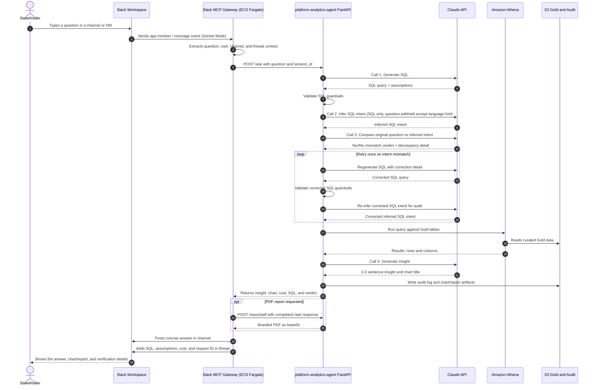

# platform-slack-mcp-gateway

Slack + MCP gateway for the Enterprise Data Platform analytics agent.

This repository is an additive extension. It does not replace or rewrite the
existing `platform-analytics-agent`. Slack becomes another stakeholder entry
point into the same analytics engine.

## Purpose

Stakeholders should be able to ask questions in Slack and receive:

- A concise Slack-native answer.
- The chart image generated by the analytics agent.
- The branded PDF report.
- Query assumptions, intent verdict, and Athena scan cost.
- A link back to the full Streamlit experience when a richer UI is needed.

## Architecture



The gateway should call the existing analytics API instead of duplicating
analytics logic. The current browser UI and report design stay owned by
`platform-analytics-agent`.

### Beginner-friendly flow

Slack is a second front door into the same analytics engine used by the
Streamlit browser app. It does not have its own SQL generator, chart renderer,
or Athena logic.

1. **Stakeholder in Slack** asks a plain-English question in a channel or direct
   message. This is the user experience: no AWS console, no SQL editor, no
   dashboard login.
2. **Slack Workspace** receives the message and sends an event to the Slack app.
   Slack is acting like the messenger between the user and the gateway.
3. **Slack MCP Gateway** is a small Python service running on ECS Fargate. It
   listens to Slack events using Socket Mode, cleans up the message, and calls
   the analytics API.
4. **Analytics Agent FastAPI** receives the same `/ask` request the Streamlit UI
   would send. This keeps one source of truth for SQL generation, guardrails,
   chart creation, cost tracking, and audit logging.
5. **Claude API** helps generate SQL, cross-check SQL intent, and write the
   final plain-English insight.
6. **Amazon Athena** runs the validated SELECT query against the Gold tables.
   Athena reads files directly from S3, so the agent does not need a database
   server of its own.
7. **S3 Gold** holds the curated business mart tables. These are the only data
   tables the agent is allowed to query.
8. **S3 Audit** stores the trace of the request: question, SQL, assumptions,
   scan cost, response time, request ID, and report artifacts.
9. **Slack MCP Gateway** formats the API response for Slack: short answer in the
   channel, chart/report attachment when available, and technical details in a
   thread for verification.

In one sentence: Slack handles the conversation, the gateway handles Slack
plumbing, and `platform-analytics-agent` handles the analytics.

## Slack Setup

You already created the Slack app:

- App name: `EDP Analytics Agent`
- Recommended bot display name: `EDP Analyst`
- Recommended demo channel: `#analytics-agent-demo`

Required tokens:

```text
SLACK_APP_TOKEN=<slack-app-token>
SLACK_BOT_TOKEN=<slack-bot-token>
```

Do not commit real token values.

For repo-owned GitHub deploys, save these as GitHub Actions secrets in the
`platform-slack-mcp-gateway` repository, preferably scoped to the `dev`,
`staging`, and `prod` environments:

```text
SLACK_APP_TOKEN
SLACK_BOT_TOKEN
```

The deploy workflow copies those values into AWS Secrets Manager for the ECS
task. The session orchestrator can still deploy this repo for end-to-end demos,
but this repository owns its own CI and deploy path.

### Required Bot Token Scopes

Add these in Slack app settings under **OAuth & Permissions**:

```text
app_mentions:read
channels:history
channels:read
chat:write
files:write
im:history
im:read
im:write
```

After changing scopes, click **Reinstall to Workspace** and copy the
**Bot User OAuth Token** from **OAuth Tokens**.

### Socket Mode

Socket Mode should be enabled for demo and dev because it avoids needing a
public Slack request URL.

Required app-level token scope:

```text
connections:write
```

### Event Subscriptions

Subscribe the bot to:

```text
app_mention
message.im
```

Then invite the bot to the demo channel:

```text
/invite @EDP Analytics Agent
```

## Local Environment

Create a local `.env` file from `.env.example`:

```text
SLACK_APP_TOKEN=<slack-app-token>
SLACK_BOT_TOKEN=<slack-bot-token>
ANALYTICS_AGENT_URL=http://localhost:8080
```

For deployed AWS sessions, `ANALYTICS_AGENT_URL` should point at the existing
analytics agent ALB/API endpoint.

## Local Development

Install dependencies:

```bash
python -m venv .venv
source .venv/bin/activate
pip install -r requirements.txt -r requirements-dev.txt
```

Run tests with the standard library:

```bash
python -m unittest discover -s tests
```

Run the gateway locally:

```bash
python -m gateway.main
```

Run with Docker:

```bash
docker compose up --build
```

The first gateway implementation listens for Slack app mentions and direct
messages, calls `POST /ask` on `platform-analytics-agent`, then posts a
Slack-native answer with assumptions, cost, intent verdict, SQL, request ID,
and a chart link when the analytics agent returns one. It then calls
`POST /report/pdf` and uploads the branded PDF report into the same Slack
thread.

## Build And Destroy Plan

The Slack workspace and Slack app identity should remain stable.

The disposable session resources are:

- ECS service for this gateway.
- ECR image.
- CloudWatch logs.
- IAM task roles.
- Secrets Manager values.
- Optional internal service discovery.

The session orchestrator can add an optional deploy stage:

```text
DEPLOY_SLACK_MCP=true
```

Recommended flow:

1. Start the existing EDP session.
2. Run the data pipeline.
3. Deploy `platform-analytics-agent`.
4. Deploy this Slack MCP gateway.
5. Demo Slack questions.
6. Destroy AWS runtime resources when done.
7. Keep the Slack workspace/app for the next session.

## Terraform Scope

Terraform should manage AWS infrastructure:

- ECR repository.
- ECS task definition and service.
- CloudWatch log group.
- IAM roles and policies.
- Security groups.
- Secrets Manager secret placeholders.
- Outputs for service name, log group, and secret names.

Terraform should not destroy and recreate the Slack workspace or app for every
demo. Slack app setup is documented and portable via the app manifest in this
repo.

## GitHub Deployment

This repo follows the same GitHub OIDC model as the other deployable platform
services.

One-time prerequisites:

1. Add `platform-slack-mcp-gateway` to the GitHub OIDC allowlist in
   `terraform-bootstrap`, then apply bootstrap.
2. Add this repo to `terraform-github-setup`, then apply it so GitHub
   environments and the `AWS_ACCOUNT_ID` repository variable exist.
3. Apply `terraform-platform-infra-live` with the Slack MCP module enabled for
   the target environment so ECR, ECS, logs, IAM, and secret placeholders exist.
4. Add `SLACK_APP_TOKEN` and `SLACK_BOT_TOKEN` to this repo's GitHub Actions
   secrets for each environment.

After CI passes on `main`, use the manual `.github/workflows/deploy.yml`
`workflow_dispatch` trigger for `dev`, `staging`, or `prod`.

## Enterprise Guardrails

### Implemented

- **Channel allowlist** — the gateway reads `SLACK_ALLOWED_CHANNELS` (comma-separated) from environment config. Messages from any channel not in the list are silently ignored. An empty allowlist allows all channels. Configured via the `slack_mcp_allowed_channels` Terraform variable.
- **Direct message filtering** — bot-to-bot DMs are filtered out automatically. Only human-initiated messages reach the Analytics Agent.
- **SQL guardrails** — enforced by the Analytics Agent backend: SELECT-only, Gold layer only, DDL keywords rejected, LIMIT always injected. The gateway never generates or executes SQL itself.
- **Audit trail** — every question is written to the engineer log in S3 (`metadata/engineer-log/`) with Slack channel, question, SQL, cost, request ID, and timestamp.
- **Separate per-environment Slack apps** — dev, staging, and prod each use independent `SLACK_APP_TOKEN` and `SLACK_BOT_TOKEN` secrets configured in GitHub Actions environments.

### Not yet implemented

- Per-user and per-channel rate limits (the Analytics Agent backend has a session-level rate limiter, but no Slack-user-level limit).
- Slack user or group allowlist (channel-level filtering only today).
- Confirmation flow before sending queries above a cost threshold.
